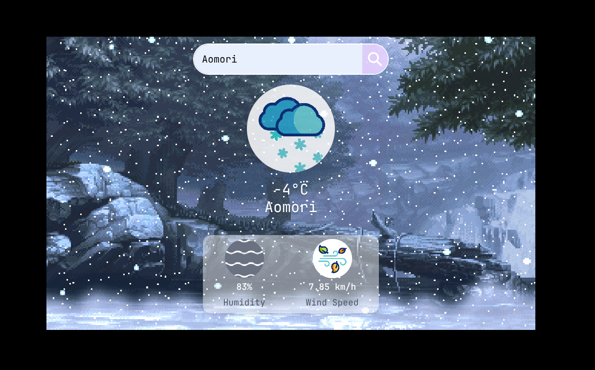
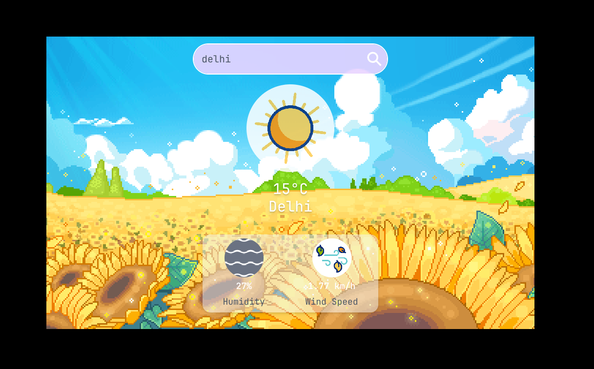

<p align="center">
  
  
</p>
<p align="center">
  
</p>

> Animated background with smooth UI  
> _(Screenshots/GIFs can be added here later)_

---

# 🌦️ LiveWeather App

LiveWeather is a modern weather application built using **React + TypeScript + Vite**.  
It shows real-time weather information using a **free public weather API**, featuring an **animated GIF background** and a **clean, cool UI** for an engaging user experience.

---

## ✨Features

- 🌍 Real-time weather data
- ☁️ Uses a free public Weather API
- ⚡ Built with Vite for fast performance
- 🎨 Cool UI with animated GIF background
- 🔄 Live data fetching
- 🧠 Written in TypeScript for better type safety

---

## 🛠️ Tech Stack

- **Frontend:** React
- **Language:** TypeScript
- **Bundler:** Vite
- **Styling & UI:** Tailwind CSS,shadcn/ui
- **API:** Free Weather API
- **Version Control:** Git & GitHub

---

## ⚙️ Installation & Setup

Follow these steps to run the project locally:

```bash
# Clone the repository
git clone https://github.com/souravsolutions/LiveWeather.git

# Install dependencies
pnpm install

# Start the development server
pnpm run dev

## environment variables

VITE_API_KEY=YOUR_API_KEY
VITE_BASE_URL=YOUR_BASE_URL

# Open the app in your browser
open http://localhost:5173
```

---

## ⭐ Support

If you like this project, don’t forget to star ⭐ the repository
It motivates me to build more awesome projects!
